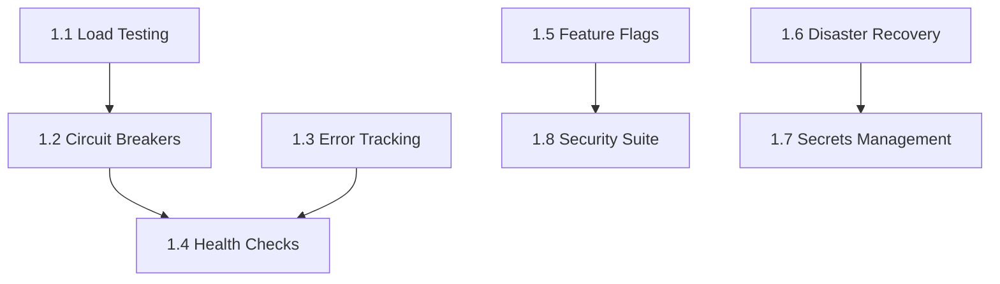

# Phase 1: Production Hardening

## Overview

**Goal**: Achieve production-grade reliability, observability, and security
**Duration**: 2 weeks
**Score Impact**: Production Readiness 72 → 88 (+16)

## Slices

### Slice 1.1: Load Testing Infrastructure

**Goal**: Prove system handles 10K emails/minute

**User Story**:
> As an MSP administrator, I need confidence that Swordfish can handle my clients' email volume without degradation so that I can onboard enterprise customers.

**Acceptance Criteria**:
- [ ] System processes 10,000 emails/minute sustained
- [ ] Response times stay under p95 < 500ms
- [ ] Memory usage remains bounded
- [ ] No connection leaks after 1 hour sustained load
- [ ] Graceful degradation at 150% capacity

**Tests**:
```typescript
// tests/load/email-throughput.test.ts
describe('Load Testing', () => {
  it('should process 100 concurrent emails')
  it('should process 500 concurrent emails')
  it('should process 1000 concurrent emails')
  it('should maintain p95 latency under 500ms')
  it('should not leak connections under load')
  it('should gracefully degrade at capacity')
});
```

**Implementation**:
- `lib/testing/load-runner.ts` - Load test orchestrator
- `lib/testing/metrics-collector.ts` - Real-time metrics
- `tests/load/email-throughput.test.ts`
- `tests/load/api-endpoints.test.ts`
- `tests/load/database-stress.test.ts`

---

### Slice 1.2: Circuit Breakers

**Goal**: Graceful degradation when external services fail

**User Story**:
> As a system, I need to handle external service failures gracefully so that one failing dependency doesn't cascade to total system failure.

**Acceptance Criteria**:
- [ ] Circuit opens after 5 consecutive failures
- [ ] Circuit half-opens after 30 second timeout
- [ ] Circuit closes after 3 successful probes
- [ ] Fallback responses returned when circuit open
- [ ] Circuit state visible in health checks
- [ ] Metrics emitted for circuit events

**Tests**:
```typescript
// tests/resilience/circuit-breaker.test.ts
describe('Circuit Breaker', () => {
  it('should open after consecutive failures')
  it('should half-open after timeout')
  it('should close after successful probes')
  it('should return fallback when open')
  it('should track per-service state')
  it('should emit metrics on state change')
  it('should persist state across restarts')
});
```

**Implementation**:
- `lib/resilience/circuit-breaker.ts`
- `lib/resilience/fallbacks.ts`
- `tests/resilience/circuit-breaker.test.ts`

---

### Slice 1.3: Error Tracking Integration

**Goal**: Catch and report all production errors

**User Story**:
> As a developer, I need visibility into production errors with full context so that I can diagnose and fix issues quickly.

**Acceptance Criteria**:
- [ ] Unhandled exceptions captured with stack trace
- [ ] Error context includes tenant, user, request ID
- [ ] Source maps resolve minified stack traces
- [ ] Errors grouped by fingerprint
- [ ] Rate limiting prevents error flood
- [ ] Sensitive data (tokens, passwords) scrubbed
- [ ] Breadcrumbs track user journey

**Tests**:
```typescript
// tests/monitoring/error-tracking.test.ts
describe('Error Tracking', () => {
  it('should capture unhandled exceptions')
  it('should include tenant context')
  it('should scrub sensitive data')
  it('should rate limit repeated errors')
  it('should track breadcrumbs')
  it('should group similar errors')
});
```

**Implementation**:
- `lib/monitoring/error-tracker.ts`
- `lib/monitoring/context-provider.ts`
- `tests/monitoring/error-tracking.test.ts`

---

### Slice 1.4: Health Check Depth

**Goal**: Know exactly what's healthy/unhealthy

**User Story**:
> As an operations engineer, I need detailed health checks so that I can quickly identify which component is failing.

**Acceptance Criteria**:
- [ ] Database connectivity checked (query latency)
- [ ] Redis/cache connectivity checked
- [ ] Nango API health verified
- [ ] External threat feeds reachable
- [ ] Disk space adequate (>10%)
- [ ] Memory usage acceptable (<85%)
- [ ] Individual component status codes
- [ ] Aggregate health score (0-100)

**Tests**:
```typescript
// tests/api/health-deep.test.ts
describe('Deep Health Checks', () => {
  it('should check database connectivity')
  it('should check cache connectivity')
  it('should check Nango API')
  it('should check threat feeds')
  it('should report disk space')
  it('should report memory usage')
  it('should aggregate health score')
  it('should return component-level status')
});
```

**Implementation**:
- `lib/api/health-deep.ts`
- `tests/api/health-deep.test.ts`

---

### Slice 1.5: Feature Flags

**Goal**: Safe rollouts with instant rollback

**User Story**:
> As a product manager, I need to gradually roll out features to specific tenants so that we can validate changes safely.

**Acceptance Criteria**:
- [ ] Flags evaluated by tenant ID
- [ ] Flags evaluated by user ID
- [ ] Percentage-based rollouts supported
- [ ] Flag overrides for testing
- [ ] Default values when flag service down
- [ ] Flag changes audit logged
- [ ] Stale flag detection and cleanup

**Tests**:
```typescript
// tests/features/flags.test.ts
describe('Feature Flags', () => {
  it('should evaluate flag for tenant')
  it('should evaluate flag for user')
  it('should support percentage rollout')
  it('should allow test overrides')
  it('should fallback to defaults')
  it('should audit log changes')
  it('should detect stale flags')
});
```

**Implementation**:
- `lib/features/flags.ts`
- `lib/features/evaluator.ts`
- `tests/features/flags.test.ts`

---

### Slice 1.6: Disaster Recovery

**Goal**: Documented and tested recovery procedures

**User Story**:
> As an operations engineer, I need tested backup and restore procedures so that we can recover from data loss within our RTO/RPO targets.

**Acceptance Criteria**:
- [ ] Automated daily database backups
- [ ] Point-in-time recovery capability
- [ ] Backup restore tested and verified
- [ ] Data integrity verified after restore
- [ ] Backups encrypted at rest
- [ ] 30-day backup retention
- [ ] Recovery time < 4 hours (RTO)
- [ ] Recovery point < 1 hour (RPO)

**Tests**:
```typescript
// tests/backup/recovery.test.ts
describe('Disaster Recovery', () => {
  it('should create database backup')
  it('should restore from backup')
  it('should support point-in-time recovery')
  it('should verify data integrity')
  it('should encrypt backups')
  it('should enforce retention policy')
  it('should measure recovery time')
});
```

**Implementation**:
- `lib/backup/database.ts`
- `lib/backup/restore.ts`
- `scripts/backup-database.ts`
- `scripts/restore-database.ts`
- `tests/backup/recovery.test.ts`

---

### Slice 1.7: Secrets Management

**Goal**: Secure rotation without downtime

**User Story**:
> As a security engineer, I need secrets to rotate automatically without causing service disruption so that we maintain security compliance.

**Acceptance Criteria**:
- [ ] Secrets retrieved from secure vault
- [ ] Secrets cached with appropriate TTL
- [ ] Rotation detected and handled automatically
- [ ] Zero-downtime during rotation
- [ ] Secret versions tracked
- [ ] Access audit logged
- [ ] Fallback to environment variables

**Tests**:
```typescript
// tests/security/secrets.test.ts
describe('Secrets Management', () => {
  it('should retrieve secret from vault')
  it('should cache secrets with TTL')
  it('should detect rotation')
  it('should handle rotation without downtime')
  it('should track secret versions')
  it('should audit log access')
  it('should fallback to env vars')
});
```

**Implementation**:
- `lib/security/secrets.ts`
- `lib/security/rotation.ts`
- `tests/security/secrets.test.ts`

---

### Slice 1.8: Security Test Suite (Internal Pen Test)

**Goal**: Automated OWASP Top 10 testing

**User Story**:
> As a security engineer, I need automated security testing so that we catch vulnerabilities before they reach production.

**Acceptance Criteria**:
- [ ] SQL injection attempts blocked
- [ ] XSS attempts sanitized
- [ ] CSRF protection working
- [ ] Authentication bypass prevented
- [ ] Authorization boundaries enforced
- [ ] Sensitive data exposure prevented
- [ ] Security headers present and correct
- [ ] Rate limiting effective
- [ ] Input validation comprehensive

**Tests**:
```typescript
// tests/security/owasp/
describe('OWASP Security Tests', () => {
  describe('Injection', () => {
    it('should block SQL injection in query params')
    it('should block SQL injection in body')
    it('should block NoSQL injection')
  });

  describe('XSS', () => {
    it('should sanitize reflected XSS')
    it('should sanitize stored XSS')
    it('should set Content-Security-Policy')
  });

  describe('Authentication', () => {
    it('should prevent brute force')
    it('should enforce password requirements')
    it('should invalidate sessions on logout')
  });

  describe('Access Control', () => {
    it('should enforce tenant isolation')
    it('should prevent privilege escalation')
    it('should validate object ownership')
  });
});
```

**Implementation**:
- `tests/security/owasp/injection.test.ts`
- `tests/security/owasp/xss.test.ts`
- `tests/security/owasp/auth.test.ts`
- `tests/security/owasp/access-control.test.ts`
- `tests/security/owasp/headers.test.ts`

---

## Dependencies



## Deliverables

| Artifact | Description |
|----------|-------------|
| `lib/testing/load-runner.ts` | Load test orchestrator |
| `lib/resilience/circuit-breaker.ts` | Circuit breaker implementation |
| `lib/monitoring/error-tracker.ts` | Error tracking integration |
| `lib/api/health-deep.ts` | Deep health check endpoint |
| `lib/features/flags.ts` | Feature flag system |
| `lib/backup/` | Backup and restore utilities |
| `lib/security/secrets.ts` | Secrets management |
| `tests/security/owasp/` | OWASP security test suite |

## Success Metrics

| Metric | Before | After |
|--------|--------|-------|
| Production Readiness | 72 | 88 |
| Test Count | 1,270 | 1,450 |
| Load Capacity | Unknown | 10K/min |
| Recovery Time | Unknown | < 4 hours |
